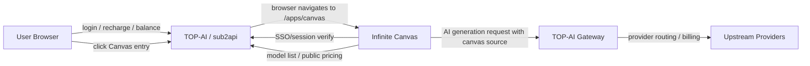

# TOP-AI Infinite Canvas Integration Plan

## Goal

把 Infinite Canvas 画布平台接入 TOP-AI 生态，让用户使用 TOP-AI 的账号、余额、充值和网关能力进入画布创作。

第一版采用“同域挂载，服务分开”的方式：

- TOP-AI/sub2api 继续作为主平台、账号中心、充值中心、计费中心和网关中心。
- Infinite Canvas 继续作为独立画布应用运行，不嵌入 sub2api 前端代码。
- TOP-AI 只提供入口、登录态校验、可用模型/价格数据、网关调用凭证或内部转发能力。
- Infinite Canvas 消费 TOP-AI 的能力，不再维护一套独立的用户充值和模型售卖逻辑。

## Current Status

当前阶段只完成方案文档，没有开始业务代码接入。

已经完成：

- 已确认文档位置：`sub2api/docs/CANVAS_INTEGRATION_PLAN.md`
- 已确认推荐入口路径：`/apps/canvas`
- 已确认第一版不嵌入 iframe，不把画布源码塞进 sub2api。
- 已确认两个项目继续平级独立：`sub2api` 和 `infinite-canvas`
- 已确认 sub2api 第一版只做最小必要改动。
- 已在 sub2api 公共首页导航增加“AI 画布 / AI Canvas”入口，浏览器跳转到 `/apps/canvas`。
- Infinite Canvas 已支持 `CANVAS_BASE_PATH=/apps/canvas`，静态资源、同源 API、WebDAV proxy 和普通 href 会使用 base path。

还没有改：

- sub2api 登录后控制台侧边栏还没有新增可选“AI 画布 / Canvas”入口。
- sub2api 后端还没有新增 canvas session/SSO endpoint。
- sub2api 网关计费还没有增加 `source=canvas` 来源标记。
- sub2api 还没有提供给画布服务端使用的内部调用凭证方案。
- Infinite Canvas 还没有接入 TOP-AI 登录态。
- Infinite Canvas 还没有隐藏本地登录、注册、充值、credits 展示。
- Infinite Canvas 的 AI 请求还没有改为走 TOP-AI Gateway。
- Infinite Canvas 的模型列表还没有改为读取 TOP-AI 模型目录。
- Infinite Canvas 的 `webdav-proxy` 等安全问题还没有修复。
- 部署层还没有增加 `/apps/canvas` 反代规则。

这些未完成项必须按后面的 Phase 顺序分阶段实现，不能一次性混在一个大提交里。

## Non-goals

第一版不做这些事情：

- 不把 Infinite Canvas 的 Next.js/React 代码塞进 `sub2api/frontend/src/`。
- 不把 Infinite Canvas 的 Go 后端直接合并进 `sub2api/backend/internal/`。
- 不把画布页面做成 iframe 镶嵌在 TOP-AI 页面里。
- 不重写 sub2api 现有充值、余额、API Key、网关计费核心逻辑。
- 不同时大范围改两个项目的目录结构。
- 不新增一套和 TOP-AI 并行的用户余额系统。
- 不让用户在画布里单独填写上游 API Key。
- 不在前端硬编码模型价格、模型列表或结算货币。

## Repository Boundaries

当前两个项目必须继续保持边界清晰：

```text
/Users/xiaodoubao/Documents/api/sub2api
  TOP-AI 主平台
  负责账号、充值、余额、计费、模型售卖、网关、公开页面入口

/Users/xiaodoubao/Documents/api/infinite-canvas
  画布平台
  负责画布交互、作品数据、素材、提示词、图片/视频生成体验
```

两个项目平级放置，不互相移动源码目录。

## Hard Rules

开发时必须遵守：

- sub2api 尽量少改，只加必要入口和必要接口。
- Infinite Canvas 保持独立服务，只接入 TOP-AI 的登录和计费能力。
- 新增文档放在 `sub2api/docs/`。
- sub2api 前端公共页面代码继续放在 `sub2api/frontend/src/views/public/`。
- sub2api 前端公共组件继续放在 `sub2api/frontend/src/components/public/` 或具体功能目录。
- sub2api API wrapper 继续放在 `sub2api/frontend/src/api/`。
- sub2api 后端 handler 继续按现有 `backend/internal/handler/`、`backend/internal/server/routes/` 规则放置。
- Infinite Canvas 前端改动继续放在 `infinite-canvas/web/src/` 原有 Next.js 结构里。
- Infinite Canvas 后端改动继续放在 `infinite-canvas/handler/`、`service/`、`middleware/`、`router/` 原有结构里。
- 不允许在 Vue 组件里直接写 API 请求细节。
- 不允许在页面组件里堆大量业务转换逻辑。
- 不允许为了接入画布复制一套 sub2api 登录逻辑到画布前端。
- 不允许公开暴露内部网关密钥、管理员接口、上游渠道配置。
- 不允许把 TOP-AI 内部应用凭证写进前端构建产物。
- 不允许在代码里写死生产域名、端口、密钥、模型价格。
- 不允许一次提交同时修改 sub2api 入口、SSO、网关计费、Infinite Canvas basePath 和安全修复。
- 每个 Phase 必须能独立验证和回滚。

## Configuration Rules

所有跨项目配置必须走环境变量或部署配置，不允许硬编码。

建议配置项：

```text
TOP_AI_PUBLIC_BASE_URL=https://top-ai.example.com
TOP_AI_INTERNAL_BASE_URL=http://top-ai-backend:3000
TOP_AI_CANVAS_APP_KEY=<server-side-only-secret>
CANVAS_BASE_PATH=/apps/canvas
NEXT_PUBLIC_CANVAS_BASE_PATH=/apps/canvas
CANVAS_API_BASE_URL=http://top-ai-canvas-api:8080
CANVAS_DISABLE_LOCAL_AUTH=true
CANVAS_DISABLE_LOCAL_CREDITS=true
CANVAS_FORCE_TOP_AI_GATEWAY=true
```

规则：

- `TOP_AI_CANVAS_APP_KEY` 只能存在于 Infinite Canvas 后端服务端环境。
- `CANVAS_BASE_PATH` 给 Infinite Canvas 构建和服务端路由使用。
- `NEXT_PUBLIC_CANVAS_BASE_PATH` 只有在浏览器端代码确实需要读取 base path 时才使用。
- 浏览器端只能知道公开 base URL 和公开 base path，不能知道服务端密钥。
- 本地开发可以用 `http://127.0.0.1`，但不能提交成生产默认值。
- 生产环境变量必须由部署系统注入，不写入 Git。
- 如果需要新增配置文件，必须放在各项目现有配置目录，不新建随意目录。

## Route Strategy

推荐生产访问路径：

- TOP-AI 主站：`https://top-ai.example.com`
- 画布入口：`https://top-ai.example.com/apps/canvas`

不推荐直接使用 `/canvas` 作为挂载根路径。

原因：

- Infinite Canvas 自身已经有用户画布页面：`/canvas`
- 如果外层也挂 `/canvas`，容易出现 `/canvas/canvas` 这种不清晰路径。
- `/apps/canvas` 更像一个应用入口，后续也方便继续增加其它应用。

第一版建议：

```text
TOP-AI 页面按钮
  -> 浏览器跳转到 /apps/canvas
  -> 部署层把 /apps/canvas 转发到 Infinite Canvas 独立服务
```

如果后续必须使用 `/canvas`，需要单独评估 Infinite Canvas 的 Next.js `basePath` 和内部路由重命名，不能直接硬改。

## High-level Architecture



## sub2api Change Scope

sub2api 第一版只做最小必要改动。

### 1. Frontend Entry

目标：让用户从 TOP-AI 主站清楚进入画布。

建议位置：

- 首页顶部操作区增加“AI 画布 / Canvas”入口。
- 登录后控制台侧边栏可后续增加“AI 画布 / Canvas”入口。
- 模型广场或文档页不强行塞入口，避免页面职责混乱。

建议文件范围：

- `frontend/src/views/HomeView.vue`
- `frontend/src/components/public/` 中已有公共顶部栏/导航组件
- `frontend/src/i18n/locales/zh.ts`
- `frontend/src/i18n/locales/en.ts`

不建议：

- 不要把画布页面组件放进 `HomeView.vue`。
- 不要在 sub2api 里复制画布 UI。
- 不要做 iframe 嵌入。

### 2. SSO Verification Endpoint

目标：Infinite Canvas 能确认当前用户是不是 TOP-AI 已登录用户。

建议新增一个轻量接口：

```text
GET /api/v1/app/canvas/session
```

返回内容只包含画布需要的最小用户信息：

```json
{
  "user_id": "top-ai-user-id",
  "display_name": "User",
  "email": "user@example.com",
  "balance_usd": 12.34,
  "status": "active"
}
```

安全规则：

- 必须基于 TOP-AI 当前登录态。
- 不返回 password、token、admin flag、内部权限组细节。
- 不返回上游渠道配置。
- 不返回用户 API Key 明文。
- 如果未登录，返回 401，由画布引导用户回 TOP-AI 登录页。

建议文件范围：

- `backend/internal/handler/`
- `backend/internal/server/routes/`
- `backend/internal/server/router.go`

注意：

- 如果现有用户信息接口已经满足，不要重复造一个大接口。
- 如果新增 endpoint，必须单独命名为 app/canvas 相关，不要混进 admin 或 public model catalog handler。

### 3. Canvas Gateway Credential

目标：画布服务端调用 TOP-AI 网关，但不能把 TOP-AI 内部凭证暴露给浏览器。

推荐方式：

- sub2api 后台为 Canvas 服务配置一个内部应用凭证。
- Infinite Canvas 后端服务端保存该凭证。
- 浏览器只调用 Infinite Canvas 自己的 API。
- Infinite Canvas 后端再用内部凭证调用 TOP-AI Gateway。
- TOP-AI 计费系统根据当前 TOP-AI 用户和 `source=canvas` 记录用量。

不推荐：

- 不要把用户自己的 TOP-AI API Key 下发到浏览器。
- 不要让用户在画布前端手动填 OpenAI/Claude/Gemini 等上游 Key。
- 不要让画布绕过 TOP-AI Gateway 直接打上游供应商。

### 4. Model And Price Source

目标：画布只展示 TOP-AI 当前真实售卖的模型和美元价格。

优先复用已有模型广场的公开模型目录能力：

- `GET /api/v1/public/models/catalog`

如果画布需要更多内部字段，应新增 canvas 专用 DTO，而不是直接暴露 admin/channel DTO。

规则：

- 只返回可售卖模型。
- 只返回美元价格。
- 不返回上游账号、渠道权重、真实成本、供应商密钥。
- 不在画布前端硬编码模型列表。

### 5. Usage Source Tag

目标：账单能区分来自普通 API 调用还是画布调用。

建议在计费记录中保留来源：

```text
source = canvas
```

第一版可以只作为备注或 metadata，不强行重构计费表。

## Infinite Canvas Change Scope

Infinite Canvas 需要适配成 TOP-AI 的消费应用。

### 1. Disable Local Auth Surface

目标：用户身份以 TOP-AI 为准。

处理方式：

- 关闭或隐藏画布自己的注册入口。
- 关闭或隐藏画布自己的登录入口。
- 未登录用户访问画布时跳回 TOP-AI 登录页。
- 已登录用户进入画布后，由画布后端调用 TOP-AI SSO endpoint 建立本地映射。

本地映射建议：

```text
canvas_user.id
canvas_user.top_ai_user_id
canvas_user.display_name
canvas_user.email
canvas_user.created_at
canvas_user.updated_at
```

注意：

- Infinite Canvas 可以保留自己的用户表，用来保存画布作品归属。
- 但余额、充值、会员、可用模型不以画布自己的表为准。

### 2. Disable Local Credits And Recharge

目标：不出现两套余额。

处理方式：

- 隐藏画布自己的 credits/recharge/admin credit 调整入口。
- 画布 UI 余额展示来自 TOP-AI。
- 余额不足时跳转 TOP-AI 充值页。

保留：

- 画布自己的作品、素材、提示词、历史记录。

不保留：

- 面向用户展示的本地 credits 售卖逻辑。

### 3. Route And Base Path

目标：让画布能在 `/apps/canvas` 下稳定运行。

需要评估：

- `infinite-canvas/web/next.config.ts`
- `infinite-canvas/web/src/app/api/[...path]/route.ts`
- `infinite-canvas/web/src/app/(user)/canvas`
- 前端所有绝对路径、跳转路径、资源路径

推荐方式：

- 使用环境变量控制部署路径，例如 `CANVAS_BASE_PATH=/apps/canvas`。
- Next.js `basePath` 根据环境变量启用。
- API proxy 继续走相对路径，不写死本地端口。

注意：

- Next.js `basePath` 会进入客户端构建产物，生产路径变化后需要重新构建画布前端。
- 这一步需要完整浏览器验证。
- 不要靠搜索替换硬改所有 `/canvas`。
- 如果画布里存在原生 `<a href>`、`window.location.href`、手写 `fetch("/api/...")`，必须单独检查，不假设 Next.js 自动处理全部路径。

### 4. AI Request Flow

目标：所有 AI 生成调用通过 TOP-AI 网关计费。

推荐调用链：

```text
Browser
  -> Infinite Canvas API
  -> TOP-AI Gateway internal endpoint
  -> Upstream model provider
```

画布后端需要带上：

- TOP-AI user id
- model id
- request type: image/video/chat/edit
- source: canvas
- idempotency key

TOP-AI 返回：

- 成功结果
- 余额不足
- 模型不可用
- 限流
- 上游失败

画布 UI 负责把这些错误展示成人能看懂的提示。

### 5. Security Fixes Before Public Launch

上线前必须先处理这些风险：

- `webdav-proxy` 不能作为无鉴权开放代理。
- AI 请求 body 必须加大小限制。
- 生成接口必须有用户限流。
- 公开媒体引用地址要考虑过期、鉴权或不可猜测。
- 管理端 channel test 不允许成为 SSRF 入口。
- 默认注册、默认免费模型、默认 0 成本配置必须关闭或受控。

## Deployment Plan

推荐服务形态：

```text
top-ai-web
  sub2api frontend + backend

top-ai-canvas-web
  Infinite Canvas Next.js frontend

top-ai-canvas-api
  Infinite Canvas Go backend
```

反代规则示例：

```text
/                -> sub2api
/api             -> sub2api backend
/apps/canvas/api -> Infinite Canvas API proxy or Canvas backend
/apps/canvas     -> Infinite Canvas frontend
```

实际规则要根据部署环境决定。

注意：

- `/api` 目前通常属于 sub2api，不能被画布抢走。
- 画布自己的 API 建议挂到 `/apps/canvas/api` 或由画布前端内部 proxy 处理。
- 反代匹配顺序必须让画布路径整体优先于 sub2api 默认路由。
- 如果同时配置 `/apps/canvas/api` 和 `/apps/canvas`，更具体的 `/apps/canvas/api` 必须优先于 `/apps/canvas`，避免画布 API 被前端页面路由吃掉。
- 如果部署平台不适合 path mount，备用方案是 `canvas.top-ai.example.com` 子域名，但仍然保持 TOP-AI 统一登录和计费。
- CORS 尽量不要放开到 `*`。
- Cookie domain/path 要提前设计，避免登录态读不到或互相污染。

## Development Phases

### Phase 0: Preparation

目标：只确认边界，不写业务代码。

任务：

- 确认生产域名和画布入口路径，推荐 `/apps/canvas`。
- 确认画布是否继续独立 Docker 服务。
- 确认 TOP-AI 登录态形式。
- 确认模型价格以模型广场公共接口为准。
- 确认第一版不开放画布本地充值。

验收：

- 本文档确认无异议。
- 不产生业务代码改动。

### Phase 1: TOP-AI Minimal Entry

目标：TOP-AI 页面能跳转到画布。

sub2api 改动：

- 首页增加“AI 画布 / Canvas”入口。
- 登录后控制台可选增加菜单入口。
- i18n 增加中英文文案。

不做：

- 不嵌入 iframe。
- 不复制画布 UI。

验收：

- `/home` 可以看到入口。
- 中英文切换正常。
- 入口跳转到 `/apps/canvas`。

### Phase 2: Same-domain Mount

目标：画布可在 TOP-AI 同域路径访问。

部署改动：

- 增加 `/apps/canvas` 反代。
- 调整 Infinite Canvas basePath。
- 修复资源路径、跳转路径、API proxy 路径。

验收：

- 直接访问 `/apps/canvas` 正常打开。
- 刷新任意画布子页面不 404。
- 静态资源加载正常。
- 浏览器控制台无关键资源 404。

### Phase 3: SSO And User Mapping

目标：画布识别 TOP-AI 登录用户。

sub2api 改动：

- 提供最小 SSO/session endpoint。

Infinite Canvas 改动：

- 访问画布时校验 TOP-AI 登录态。
- 未登录跳转 TOP-AI 登录页。
- 已登录建立或更新本地用户映射。
- 隐藏画布本地登录/注册入口。

验收：

- 未登录访问画布会回到 TOP-AI 登录。
- 登录后进入画布能识别同一个用户。
- 不暴露用户 API Key。

### Phase 4: Model And Billing Integration

目标：画布使用 TOP-AI 模型和余额。

sub2api 改动：

- 复用或扩展公开模型目录。
- 提供内部网关调用凭证或服务端调用方式。
- 用量记录带 `source=canvas`。

Infinite Canvas 改动：

- 模型列表来自 TOP-AI。
- AI 请求走 TOP-AI Gateway。
- 余额不足时跳 TOP-AI 充值。
- 隐藏本地 credits/recharge。

验收：

- 画布只能看到 TOP-AI 可售卖模型。
- 生成图片/视频会扣 TOP-AI 余额。
- TOP-AI 后台能看到画布来源用量。
- 余额不足提示正确。

### Phase 5: Security Hardening

目标：解决公开上线前风险。

任务：

- 修复 `webdav-proxy` 开放代理问题。
- AI 请求加 body 限制。
- 用户维度限流。
- 媒体引用访问控制。
- 关闭危险默认配置。
- 清理本地调试入口。

验收：

- 无未鉴权开放代理。
- 无公开上游密钥。
- 无可绕过 TOP-AI 余额的生成路径。

## API Contract Draft

### TOP-AI Session Endpoint

```http
GET /api/v1/app/canvas/session
```

Response:

```json
{
  "user_id": "u_123",
  "display_name": "TOP-AI User",
  "email": "user@example.com",
  "balance_usd": 10.25,
  "status": "active"
}
```

Errors:

```text
401 unauthenticated
403 disabled
```

### TOP-AI Public Model Catalog

优先复用：

```http
GET /api/v1/public/models/catalog
```

画布只读取公开字段。

### Canvas AI Request To TOP-AI

内部服务调用必须包含：

```json
{
  "top_ai_user_id": "u_123",
  "model": "gpt-image-or-video-model",
  "source": "canvas",
  "request_type": "image_generation",
  "idempotency_key": "canvas-request-id"
}
```

具体 endpoint 根据 sub2api 现有网关能力定，不在第一版文档里强行定死。

## Data Ownership

TOP-AI owns:

- 用户账号
- 登录态
- 余额
- 充值订单
- 计费记录
- 模型售卖价格
- API 网关
- 上游渠道配置

Infinite Canvas owns:

- 画布项目
- 画布节点
- 作品历史
- 用户素材
- 提示词素材库
- 生成任务展示状态
- 本地用户映射表

共享但不互相泄漏：

- TOP-AI user id
- 模型公开售卖信息
- 生成请求来源标记

## Risk And Mitigation

| Risk | Impact | Mitigation |
|------|--------|------------|
| 两套登录并存 | 用户困惑，权限绕过 | 第一版隐藏画布本地登录注册，只认 TOP-AI |
| 两套余额并存 | 财务和扣费混乱 | 画布只展示 TOP-AI 余额 |
| 画布直接打上游 | 绕过 TOP-AI 计费 | AI 请求必须经 TOP-AI Gateway |
| basePath 改坏资源 | 页面白屏或 404 | Phase 2 单独验证所有资源和刷新路径 |
| `/canvas` 路径冲突 | URL 难看且容易错 | 用 `/apps/canvas` |
| 开放代理 SSRF | 被攻击内网或云元数据 | `webdav-proxy` 必须鉴权、限域、禁私网 |
| 暴露模型成本 | 商业数据泄漏 | 只返回公开销售价格 |
| 同时大改两边 | 难回滚，难定位问题 | 分阶段提交，每阶段可独立验收 |

## Recommended First Implementation Order

1. 确认 `/apps/canvas` 作为入口路径。
2. 在 sub2api 首页加跳转入口，不改核心业务。
3. 部署层把 Infinite Canvas 挂到 `/apps/canvas`。
4. 让 Infinite Canvas 支持 basePath。
5. 加 TOP-AI session 校验接口。
6. 画布隐藏本地登录注册。
7. 画布读取 TOP-AI 模型目录。
8. 画布 AI 请求接入 TOP-AI Gateway。
9. 画布隐藏本地充值和 credits。
10. 修复安全问题后再公开上线。

## Rollback Plan

每个阶段都要能单独回滚：

- Phase 1 回滚：移除 TOP-AI 首页/菜单的画布入口，业务不受影响。
- Phase 2 回滚：移除 `/apps/canvas` 反代规则，Infinite Canvas 仍可回到独立端口或独立域名运行。
- Phase 3 回滚：关闭 Canvas SSO 校验开关，恢复仅内部测试访问，不开放给用户。
- Phase 4 回滚：关闭 Canvas 走 TOP-AI Gateway 的开关，禁止公开生成入口，避免绕过计费。
- Phase 5 回滚：安全修复不能回滚到不安全状态；如果修复引起问题，应关闭相关功能而不是恢复开放代理或无限制请求。

回滚原则：

- 优先关入口，不删数据。
- 优先关生成能力，不绕过 TOP-AI 计费。
- 不回滚到泄漏密钥、开放代理、无限流的状态。
- 每个 Phase 单独提交，提交信息写清楚影响范围。

## Acceptance Checklist

- [ ] sub2api 和 Infinite Canvas 仍然是两个独立项目目录。
- [ ] sub2api 没有嵌入画布 React/Next.js 源码。
- [ ] Infinite Canvas 没有复制 sub2api 的充值和余额逻辑。
- [ ] TOP-AI 首页有清晰的画布入口。
- [ ] 画布能从 `/apps/canvas` 打开。
- [ ] 未登录用户不能直接使用画布生成能力。
- [ ] 登录用户进入画布后对应同一个 TOP-AI 用户。
- [ ] 模型列表来自 TOP-AI。
- [ ] 价格只显示美元。
- [ ] AI 生成通过 TOP-AI Gateway。
- [ ] 扣费进入 TOP-AI 余额/账单体系。
- [ ] 用量记录能看出 `source=canvas`。
- [ ] 没有开放代理、明文密钥、绕过计费路径。
- [ ] 中英文入口文案完整。
- [ ] 每个阶段都有独立提交，方便回滚。
